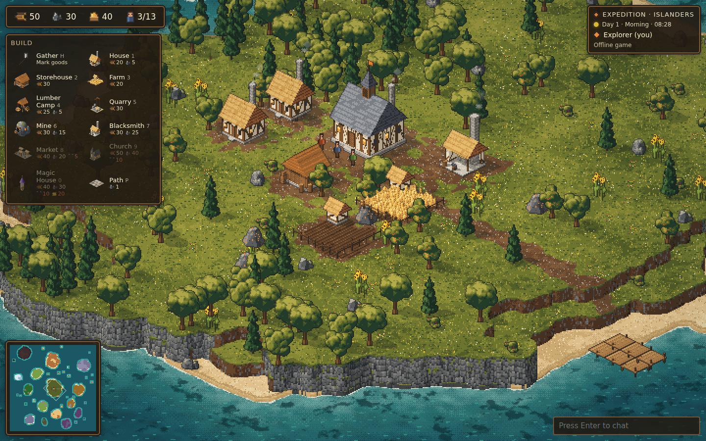
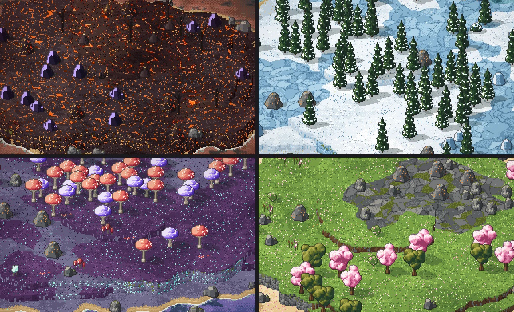
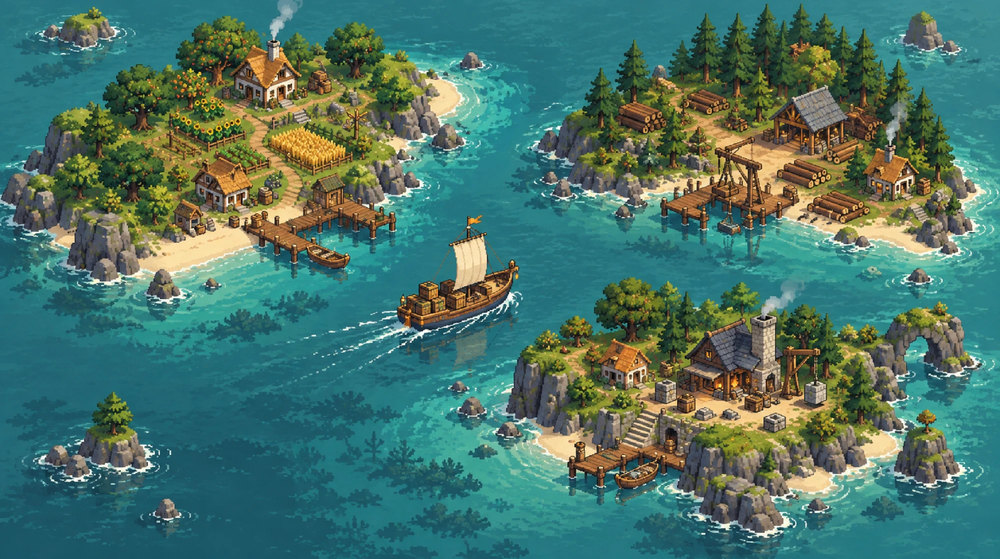
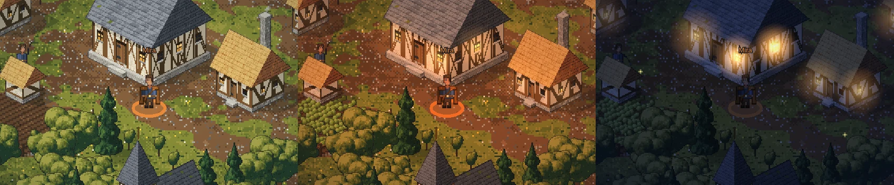

# Explorer

A co-op, browser-based isometric pixel-art game about exploring a randomly generated archipelago and building a settlement together. Up to 8 players share one tribe, one stockpile and one map.





The art style follows the concept art below. Everything is **generated in code** using a palette sampled from it: objects are baked into a sprite atlas, and the land itself (coasts, beaches, cliffs, foam and shallows) is painted per pixel while the game runs, so it never looks like a grid of tiles.

<details>
<summary>Concept art</summary>



</details>

## Play

Requirements: Node 24+ and pnpm 11 (`corepack enable` gives you the pinned version).

```bash
pnpm install
pnpm dev
```

`pnpm dev` starts both parts:

- the game server on http://localhost:8787
- the Vite client on **http://localhost:5190**, which is the one to open

The site root is the landing page; the game itself lives at **/play** (http://localhost:5190/play). Pick a tribe, start an expedition, then use **Copy invite link** to bring up to 7 friends. Invite links look like `/play/w/<id>`.

- **Offline:** "Play offline" in the lobby (or `/play?offline&seed=anything&tribe=northfolk`) runs the whole simulation in your browser. Nothing is saved.
- **Production:** `pnpm build && pnpm start` builds the client, and the Node server then serves the landing page, the game and the API from one port (8787).
- **Old links:** invite links (`/w/<id>`) and offline URLs (`/?offline…`) from before the game moved to /play redirect there.

### Controls

| Action | How                                                                                                                                                                                             |
| ------ | ----------------------------------------------------------------------------------------------------------------------------------------------------------------------------------------------- |
| Walk   | WASD / arrow keys, or right-click the ground with nothing selected. The camera is bound to your character; the wheel zooms                                                                      |
| Zoom   | Mouse wheel, `+` / `-`                                                                                                                                                                          |
| Build  | `1`–`9`, `0`, `B` (dock), `L` (lighthouse), `P` (path) or the build menu, then click. Shift-click keeps placing. Paths can be dragged                                                           |
| Select | Click a villager, ship, building or resource                                                                                                                                                    |
| Order  | With a villager selected, right-click a resource, building, ship, bones or the ground. With a ship selected, right-click the sea, an island, a dock (cargo ships), a shipwreck or a sunken site |
| Cancel | `Esc` or right-click                                                                                                                                                                            |
| Chat   | `Enter`                                                                                                                                                                                         |
| Map    | `M` opens the chart of the archipelago (or use the Map button by the minimap). `M` or `Esc` closes it                                                                                           |
| Sound  | `N` mutes or unmutes (or the Sound button in the expedition panel). Your choice is remembered                                                                                                   |
| Home   | `C` centres on the town hall (it brings the camera back to your character)                                                                                                                      |
| Pack   | `I` opens your pack, `E` picks up what lies within reach, right-click an item to walk over and take it                                                                                          |

### Inside buildings

Finished town buildings can be entered: click one and your character walks to its door and goes in. The screen goes black around a small furnished room (beds and a hearth in a house, a counter and crates in the market, a forge and anvil at the blacksmith, pews and an altar in the church, bookshelves and a cauldron at the magic house, a model of the monument at the Great Work, a chart table at the dock) with one named NPC. Walk about with WASD or a click; other players in the same building are there too. Step onto the door tile, press the Leave button or `Esc` to go back out.

**All of a building's business is done by talking to its NPC** (click them; you walk up first): the steward welcomes new villagers, the merchant trades, the sage teaches upgrades, the harbourmaster builds ships (and teaches the dock upgrades), the architect funds the Great Work, and every NPC will, if asked, pull the building down. The server enforces it: those commands are only accepted from a player inside that building and within reach of its NPC. Buildings you cannot go into (farm, lumber camp, quarry, mine, storehouse, lighthouse, paths) keep their click-to-inspect panel, and so do building sites.

Rooms are plain data in `packages/shared/src/sim/interiors.ts` (size, door, furniture, NPC), drawn by `packages/client/src/render/room.ts` and dressed with the speech in `packages/client/src/ui/dialog.ts`.

### Your character

Every world is an adventure: each player controls one character of their own instead of commanding villagers from above. (There used to be a separate Colony mode; it is gone, and worlds saved by older versions simply load as adventures.)

What works so far:

- **One character per player.** It appears on the shore beside the town hall the first time you join (each of the 8 players gets a spot of their own), and is where you left it when you come back, even after a server restart. Everyone sees everyone's character, drawn with a ring in the player's colour and their name above it, and as a dot in the player's colour on the minimap.
- **Walk with WASD or the arrow keys** (W is up the screen), or right-click the ground with nothing selected and your character walks there by the shortest way (faster on paths). Right-click a tree, rock or building and you walk to the ground beside it. Keys slide you along walls. Only you can move your character. Selecting a villager or ship first lets you right-click orders for it instead.
- **The camera is bound to your character.** It stays on you wherever you go; dragging the ground does not move it (the wheel still zooms).
- **You stand out.** Your character is drawn a quarter larger than a villager, in your tribe's dress, with a cape and sash in your player colour. The cape is a separate greyscale layer that the game tints, which is where character customization will plug in later.
- **Your character counts as a foothold** on the island it stands on, sees a little further than a villager (6 tiles, and it uncovers the map as it goes), and keeps buildings from going up on top of it.
- **Villagers run the settlement by themselves.** Nobody orders them about:
  - When a building needs raising, the nearest villager on its island drops whatever they are doing (a house wants one builder, the Great Work three) and builds it. When it is done they look for a new job.
  - A new job is whichever kind the settlement has the fewest workers on, against target shares: 30% wood, 25% food, 15% stone, 15% ore, 10% tools and 5% faith, with a nudge towards whatever the treasury is short of. They staff a free workplace (lumber camp, farm, quarry, mine, blacksmith, church) if there is one, and otherwise gather trees, berries, rocks and ore by hand.
  - Every few seconds one hand-gatherer from the most over-staffed kind of job moves to a free workplace of a kind that is short of workers, so a newly built farm or mine gets its worker even when everyone is busy.

- **A pack of your own.** Each character carries up to 12 stacks of items (bread to start with), kept apart from the settlement's goods and saved with the world. Press `I` (or the Pack button) to open it, select a stack, and drop one or all of it on the ground where you stand. Anyone can pick an item up: press `E` next to it, or right-click it and your character walks over and takes it. Items lie on land only, never in the sea (dropping into the water is refused, and drops never slide onto water or a pier), and a full pack leaves the item where it is.
- **Things to find.** Every island but your home one has a few items lying about, always one treasure its biome is known for (amber in the dunes and Amberwood, pearls in the jungle and the glowing caverns, crystal shards on the crystal isles, relic shards on the infernal ones, and so on). `scatterLoot` places them deterministically from the world seed; `grantItem` puts loot straight into a character's pack (overflow falls on the ground), so chests, wrecks and sunken sites can hand out items the same way later.

What is planned, in order: acting with your own hands (gather, build and carry goods to the stockpile), boarding and steering a ship as its captain with the rest of the crew at stations, ports run by NPCs with shops and quests, and retuning pirates, storms and costs for a crew of people rather than a fleet of villagers.

### Tribes

You choose one of nine tribes when you start a world, and the whole co-op team plays it. The tribe sets how buildings and villagers look, which biome the home island is, and one bonus.

| Tribe        | Style                                                   | Home biome      | Bonus                                                             |
| ------------ | ------------------------------------------------------- | --------------- | ----------------------------------------------------------------- |
| Islanders    | Timber frames, thatch and slate                         | Greenlands      | Ships cost 25% less and sail 25% faster                           |
| Northfolk    | Log halls with steep roofs and carved ridge horns       | Frostreach      | Woodcutting is 30% faster                                         |
| Sunfolk      | Adobe with flat roofs, parapets and blue domes          | Sunscorch Dunes | Quarrying and mining are 30% faster                               |
| Sylvan       | Living bark under leafy and blossom roofs               | Petal Isles     | Food gathering and farming are 30% faster                         |
| Glowkin      | Mushroom houses under glowing, spotted caps             | Fungal Hollows  | Lookouts and ships see as far by night as by day                  |
| Freebooters  | Bamboo, palm thatch, patched sailcloth and ships' masts | Verdant Wilds   | Every ship carries cannons, and sunk raiders leave twice the loot |
| Mirefolk     | Weathered boards under steep reed roofs, lantern-lit    | Murkmire        | Divers work twice as fast and bring up 50% more                   |
| Amberwrights | Timber frames under russet shingles, clock towers       | Amberwood       | Markets pay 30% more gold for your goods                          |
| Cinderborn   | Basalt with glowing lava joints under obsidian spires   | Infernal Isles  | Blacksmiths forge twice as fast, and no Ember Ward is needed      |

- The Freebooters start with the dock's **Cannons** fitting, and the Cinderborn with the **Ember Ward**, as if already learned.
- The Cinderborn are the hard start: their home is the grim Infernal Isles, with little food and no ore of its own (the home island always gets enough ore for a blacksmith). The gentle biomes still lie nearest home.
- A tribe's home biome never asks for its own signature good in the Great Work, so the Glowkin need no glowcap, the Mirefolk no mirepearl and the Cinderborn no hellstone.

### The world

The archipelago is **768 × 576 tiles**: a grid of 4 × 3 regions, each 192 × 192 tiles, about the size of a whole world in earlier versions. Ten of the twelve regions belong to a biome and the two furthest from home are open sea. Every biome gets **three islands of its own** (one wooded, one fertile, one rocky, so each region has wood, food and stone), plus five to nine islets; the home biome's three include your own island. The tribe's biome sits in the middle of the map, the gentle biomes around it, the hostile and magical ones towards the edges.

- **Regions are big.** The sea belongs to a biome too, out to borders that wander instead of following the grid: sail out of Greenlands water and the fog, the colour grade, the ambience and the mood change on the way to the next region. The whole map is about ten times the area of the old one, so a scout takes a couple of minutes to cross it.
- **Ships plan long routes.** Sea routes are searched with an exact-distance heuristic and a budget big enough to cross the map corner to corner.
- **Sunken sites** are spread over the whole sea in proportion to its area: about nine fortresses (over a hundred tiles from home) and three times as many ruins.
- **Raiders and storms come to you.** They form 55 to 85 tiles (raiders) or 85 to 115 tiles (storms) from somewhere your team is, either a settled island or one of your ships, picked at random, so a raid takes about as long to arrive wherever you are and outposts and far-flung ships are targets too.
- **The chart** (`M`) and the minimap scale to fit, and the fog is drawn in blocks so uncovering sea stays cheap.

Saves made before the world grew are not compatible: a world's terrain is rebuilt from its seed, and the same seed now makes a different, larger archipelago.

### Biomes

Every island belongs to one of ten biomes, with its own ground, cliffs, plants, rocks and deposits. Gentle biomes lie near home; the hellish and magical ones are furthest out. When the camera moves over a biome, the mood shifts to match: a colour grade, a tinted vignette, particles and, for grim places, a dark gritty texture. Fog of war takes each region's colour, so the sea around the Infernal Isles fogs dark red before you even see them.

| Biome           | Found       | What grows there                                | Atmosphere                 |
| --------------- | ----------- | ----------------------------------------------- | -------------------------- |
| Greenlands      | Near home   | Oaks, pines, fruit, berries, iron ore           | Calm                       |
| Verdant Wilds   | Near home   | Giant jungle trees, palms, bananas              | Humid green, fireflies     |
| Amberwood       | Near home   | Amber trees, pumpkins                           | Warm, falling leaves       |
| Petal Isles     | Near home   | Blossom trees, honey blossoms                   | Soft pink, drifting petals |
| Sunscorch Dunes | Further out | Palms, cacti, sandstone, gold veins             | Hot, blowing dust          |
| Frostreach      | Further out | Snowy pines, frost berries, ice rocks           | Cold, snowfall             |
| Murkmire        | Further out | Willows, bog mushrooms, bog iron                | Murky, fireflies           |
| Fungal Hollows  | Further out | Giant mushrooms, glowshrooms                    | Violet, floating spores    |
| Infernal Isles  | Far away    | Charred trees, ember fruit, obsidian, hellstone | Dark red, embers, grit     |
| Crystal Spires  | Far away    | Silverleaf trees, crystal clusters              | Indigo, sparkling motes    |

### Sound

All the sound is synthesised in the browser with the Web Audio API: oscillators and filtered noise, no audio files (the same idea as the art). Browsers only allow sound after you click or press a key, so it starts with your first one.

- **Ambience** follows where the camera is and what the world is doing: the sea and wind, rain in storms, insects at night, birds by day and owls after dark, and each biome's own voice (frogs in Murkmire, bubbling in the Fungal Hollows, crackling embers, crystal sparkles, blossom wind chimes).
- **Things you can hear happen**: hammering when a building goes up, chopping and picking as villagers work, coins when cargo comes home, a horn for a new ship, an arpeggio for a new island, bells for a spell, cannon fire, thunder, a ship going down, a sonar ping for a sunken site, an alarm when raiders are sighted or rob you, and a slow chord for the Great Work.
- **Placed in the world**: sounds on screen play at full volume and pan left or right by where they are; those off screen fade with distance.

### The map

Press **M** for the chart of the archipelago. It is drawn in the same isometric view as the game, so north-east on the chart is north-east on screen. Every island you have found has a name (made up from the world seed, so all players see the same ones). The chart shows:

- your settlements: gold rings, the town hall as a star, docks in teal
- each **trade route** as a dashed line from the dock a cargo ship collects at to the home dock
- your ships as arrows, pirates as red dots (on water you have explored), shipwrecks and bones as crosses, and sunken sites you have found as diamonds
- the box the camera is looking at

Hover anything for details and click it to go there. The side list gives each settlement's stockpile (with a warning when goods can't leave: no dock, or no cargo ship serving the island), the whole fleet with hull points and orders, and every wreck and sunken site with the treasure left and its bearing from home.

### Magic house upgrades

Each is learned once, for the whole team, and paid from the shared treasury with faith (from churches), gold (from the market and gold veins) and crystal (only found in the Crystal Spires).

| Upgrade      | Cost                        | Effect                                                                       |
| ------------ | --------------------------- | ---------------------------------------------------------------------------- |
| Far Sight    | 25 faith, 20 gold           | Ships reveal 60% more of the sea                                             |
| Swift Sails  | 40 faith, 30 gold           | All ships sail 50% faster                                                    |
| Ember Ward   | 50 faith, 40 gold           | Lets villagers land on the Infernal Isles (they refuse to go ashore without) |
| Prism Ward   | 50 faith, 40 gold           | Lets villagers land on the Crystal Spires                                    |
| Deep Holds   | 40 gold, 5 crystal          | Cargo ships carry 50% more                                                   |
| Seer's Chart | 60 faith, 10 crystal        | Marks every island on the map                                                |
| Stormcaller  | 60 faith, 40 gold, 3 relics | Lightning strikes pirates near your settlements and ships                    |
| Calm Waters  | 40 faith, 30 gold           | Storms cannot hurt your ships                                                |

### Pirates, wrecks and hidden treasure

**Pirates.** How often they come is the **difficulty** you pick when creating a world (it is saved with the world and shown next to the expedition name):

| Difficulty | Raids                                                                                                                                         |
| ---------- | --------------------------------------------------------------------------------------------------------------------------------------------- |
| Peaceful   | None: explore, settle and trade in peace                                                                                                      |
| Normal     | First raid after seven minutes, then one every few minutes, up to three ships at once                                                         |
| Hard       | From five minutes (at dusk), more often, one extra raider each time, 40% tougher hulls, 25% harder-hitting guns and half again as much stolen |

A raiding ship sails in from over the horizon of your settlements and ships (see The world). It hunts the nearest ship of yours, or beaches beside a storehouse, camp or dock and robs a share of that island's stockpile for eight seconds before sailing off with the loot (more raiders arrive as the days pass). A red alert appears at the top of the screen for as long as raiders are in sight (see night, below), with the direction they are in and a **Look** button that takes the camera to them.

- **Ships have hull points** (scout 30, cargo 45, patrol boat 70) and mend slowly beside a dock. A ship that sinks takes its passengers with it and leaves a wreck.
- **Defences**, from cheap to grand:
  - **Patrol boat** (80 wood, 10 tools at a dock): armed, and hunts any pirate within 18 tiles on its own until you give it an order.
  - **Cannons** (dock fitting, 60 wood, 10 tools): every ship gets guns.
  - **Iron Hulls** (dock fitting, 40 wood, 30 stone, 15 tools): 50% more hull points.
  - **Stormcaller** (magic house): lightning strikes pirates near your ships and buildings.
- **Wrecks:** a pirate that goes down at sea leaves a **shipwreck**, and one that was raiding leaves **bones** on the beach, both holding whatever it stole plus a bounty of gold, tools and sometimes a **relic**. Right-click a shipwreck with a scout or patrol boat selected, or the bones with a villager, to loot them.

**Under the sea.** Sunken ruins and a few fortresses lie in deep water, far from home. They stay hidden until a ship sails within three tiles, then show as a faint shape under the waves. Load a scout ship with villagers (they are the divers), sail over the site and press **Send divers** (or right-click the site). After 15 seconds each diver has brought up 30% of what is left. Fortresses hold gold, crystal, tools and several relics. Relics are a new resource that only wrecks and sites give; they pay for Stormcaller.

### Signature goods and the Great Work

Six far biomes each yield a good found nowhere else. They are deposits on that biome's islands (every world has enough), gathered like ore: a mine worker takes any of them within its radius, and idle villagers will mine them by hand.

| Good      | Biome           | Deposit                                              |
| --------- | --------------- | ---------------------------------------------------- |
| Sunstone  | Sunscorch Dunes | amber gems in the sand                               |
| Rimeglass | Frostreach      | tall shards of ice                                   |
| Mirepearl | Murkmire        | pearl beds in the bog                                |
| Glowcap   | Fungal Hollows  | glowing mushroom caps                                |
| Hellstone | Infernal Isles  | black rock veined with lava (it no longer gives ore) |
| Crystal   | Crystal Spires  | crystal clusters                                     |

Goods gathered on another island wait in its pile until a cargo ship brings them home, which is what the trade routes are for.

**The Great Work** is the monument the expedition is building towards. It takes 4×4 tiles on the home island, and only one can be built. Every stage is paid from the treasury when you press **Fund**, and then villagers raise it, so the monument grows through the game:

1. **Foundation**: 120 wood, 160 stone, 15 tools (paid when you place it).
2. **Pillars**: 120 stone, 40 gold, 15 tools and 40 each of sunstone, rimeglass, mirepearl and glowcap.
3. **The Crown**: 40 faith, 100 gold, 20 tools, 6 relics, 60 hellstone and 60 crystal.

Your own home biome's good is not asked for (Northfolk need no rimeglass, Sunfolk no sunstone). The panel shows what each stage needs, what the treasury holds and where to look for each good, including the islands you have found for it. When the last stage is done everyone sees the **chronicle**: days at sea, islands found and settled, goods hauled home, wrecks salvaged, pirates sunk, ships lost, raids, storms and upgrades. The game carries on afterwards, and the chronicle can be read again from the monument. A tiered top bar wraps onto a second row when you hold a lot of different goods.

### Day and night

One day lasts eight minutes of game time and starts in the morning. The HUD clock under the expedition name shows the day, the part of the day and the time. Dawn is warm, dusk golden, and night deep blue with fireflies, while houses, churches, the town hall and forges light their windows.



Night is not only scenery:

- **Raids come at dusk.** A raid that falls due by day waits for the sun to go down.
- **Lookouts go blind.** By day your buildings keep watch over 14 tiles of sea and your ships over 10. After dark that shrinks to what their own lamps light: 6 and 4 tiles. Raiders outside that are unseen: they don't show on the screen, the minimap or the chart, don't raise the alert, and patrol boats won't chase them.
- **Ships and villagers see less** of the sea at night (up to 40% less), so exploring in the dark reveals less.
- **The lighthouse** (60 wood, 60 stone, 10 tools) fixes all three: its beam watches 24 tiles, day and night, sweeping over the sea after dark. Within its reach raiders are seen, patrol boats keep hunting and ships keep their full sight. Finishing one also reveals 16 tiles around it. Every tribe builds its own.

### Storms

A storm front forms out at sea, some way from your settlements or ships, every few minutes and drifts across the sea for a couple of minutes, with rain and lightning over it. Any ship inside it, yours or a pirate's, loses hull points until it sails out, unless it is moored at a finished dock (within four tiles of the pier). A toast tells you when one forms, and an alert appears while one is closing on ships of yours that are out in the open. Cargo ships wait in port while a storm sits on their route. **Calm Waters** (magic house) makes your ships immune. In a Peaceful world storms are only weather; on Hard they hit half again as hard and come more often.

### How a settlement grows

- **Villagers pick up work by themselves:** building sites first, then staffing workplaces, then marked resources. They carry up to 5 goods to the nearest town hall, storehouse or camp on their island. Trees regrow from their stumps.
- **Houses** add room for 4 villagers. You train new villagers at the town hall for 20 food.
- **Workplaces** take one worker each:
  - Lumber camps fell trees, quarries break rocks, and mines dig ore, gold and crystal, all within a radius.
  - Farms grow food. The blacksmith forges 2 ore into 1 set of tools. The church gathers faith.
- **Advanced buildings** need tools: the market (sell lots of 10 goods for gold, or buy basics), the church, the lighthouse and the magic house. The magic house sells upgrades (see below).
- **Exploring:** the dock builds scout ships. Sailing clears the fog for everyone, and each newly found island is announced.
- **Settling:** select a ship next to the shore (or at the pier) and press **Take a villager aboard**, or right-click the ship with a villager selected. Then right-click another island to sail there and put everyone ashore. Once your villagers stand on an island you can build there. Put up a storehouse first, so they have somewhere to drop off goods.
- **Trade routes:** each island keeps its own stockpile. Goods gathered at home go into the shared treasury that pays for everything; goods gathered on another island wait in a pile on that island until a cargo ship brings them home.
  - Build a **dock** on the shore of a settled island (click the shore tile; the pier runs out over open water). The home dock cannot be demolished.
  - Docks build **cargo ships** as well as scouts (4 at most). Select a cargo ship and right-click a dock on another island to set its route: it waits for goods, loads up to 40, sails to the nearest home dock, unloads and returns, on repeat. Steering it by hand cancels the route.
  - Farms, forges and churches on other islands produce into that island's pile too. Select a dock or storehouse to see what is waiting.

## The website

The landing site lives in `packages/client` next to the game: `/home` (or `/`), `/news`, `/the-lore` and `/about`. All of them share `src/site/shell.ts` (animated sea, weather, top bar) and a theme engine (`src/site/theme.ts`) that turns a biome into colours, weather and a skyline of that biome's plants and rocks.

- **Release notes** live in `src/site/content/releases.ts`. To add one, put a new object at the top of `RELEASES`: `slug`, `version`, `title`, `date`, `summary` and `sections` of `new` / `improved` / `fixed` / `changed` notes. Its **`theme`** is any biome (`"tundra"` for a December release, say): opening `/news/<slug>` dresses the whole page in that biome, and pointing at its card on `/news` previews it. `themeOverrides` tweaks single colours (`{ "--t-accent": "#ff8844" }`).
- **The Lore** (`content/lore.ts`): one chapter per biome or tribe; scrolling turns the page into the chapter's biome.
- **About** (`content/about.ts`): the development story and timeline.

## Architecture

```
packages/shared   @explorer/shared: deterministic core used by client and server
  iso.ts            2:1 isometric projection and elevation-aware picking
  world/            seeded archipelago generation, island names, A* pathfinding
  sim/              catalogue, state, commands, 10 Hz tick, pirates, weather, lookouts and diving, characters and walking, snapshots and patches
  protocol.ts       WebSocket message types
packages/art      @explorer/art: the colour palette and the per-pixel terrain painter
  terrain/          smooth fields from the tile data, ray-marched land, cliffs and water
packages/server   @explorer/server: node:http + ws, world rooms, JSON persistence
packages/client   @explorer/client: PixiJS v8 renderer, input, DOM HUD, map screen, synthesised sound, sessions
  index.html        the landing page (src/landing/): the game's own sprites, tribes and biomes, no PixiJS
  play/index.html   the game, served for every page under /play (routes in shared/src/routes.ts)
tools/sprites     palette extraction and the sprite generator → client/public/assets
```

- **Server-authoritative co-op.** Each world is a room that runs `tick()` 10 times a second. It validates every command with `applyCommand()` and broadcasts a patch with only what changed.
  - Every command is applied on behalf of the player who sent it (`applyCommand(state, cmd, actor)`). Commands about a player's own character, such as `move-character`, act on the actor's character and nobody else's; the rest are shared by the whole team.
  - Clients receive the world _seed_ plus a snapshot of the parts that change. They regenerate the terrain themselves.
  - Clients mirror state with `applyPatch()` and smooth movement between ticks.
- **Offline mode** uses the same `tick()` and `applyCommand()` in the browser (`LocalSession`), so single-player and co-op behave identically.
- **Persistence:** each world is saved to `data/worlds/<id>.json` every 30 s, when the last player leaves and on shutdown. Saves are atomic.
  - Players are identified by name plus a random token kept in `localStorage`. Only a hash of the token is stored on the server.
- **Rendering:**
  - Terrain is painted per pixel by `@explorer/art` in a Web Worker, one 16×16-tile chunk at a time, and baked into render-texture chunks together with the decoration. Painted ground is cached, so building something only redraws the decoration. The foam and shallows are painted as three wave frames that play under the ground, so shores lap and shimmer.
  - Buildings, trees, villagers and ships are depth-sorted by `x + y`. Plants and rocks get a small fixed offset inside their tile so they do not stand in rows. Terrain is drawn under every sprite, so anything standing on low ground behind a cliff or hill fades to a ghost instead of overlapping it.
  - Paths, farm fields and the trampled earth round buildings are painted into the ground from per-tile masks, so they blend into the land instead of ending at a sprite's edge.
  - Day and night colour the whole world. The time of day comes from the simulation clock (`GameState.time`), so everyone in a world sees the same sun. A colour grade is multiplied into the biome's grade, and the glow of lit windows and forges is drawn above it so darkness cannot dim it.
  - Fog of war is a smooth mask projected onto the isometric grid.
  - Zoom uses integer steps so pixels stay crisp.

## Pixel art pipeline

`pnpm sprites` regenerates the sprite atlas in `packages/client/public/assets` (a manifest, `atlas.json`, plus as many `atlas-N.png/json` pages as the art needs) and the ocean textures, in about a second:

1. **`extract-palette.ts`** samples `docs/concept-art.webp` into `palette.extracted.json`. The curated ramps in `packages/art/src/palette.ts` are hand-picked from those samples.
2. **Terrain** is not made of sprites. The world is still a grid of tiles for the simulation, but `@explorer/art` (`terrain/`) never draws a tile:
   - It turns the tile data into smooth fields: each tile's level (sea, beach, bank, plateau, hill) is interpolated between tile centres after a wobbling warp, and the contours of those fields become the coasts and cliff edges. Shores come out as curves, not staircases, and agree with the tile grid at over 99.5% of tile centres, so buildings and villagers stand on painted ground.
   - Each pixel casts a view ray through the fields to find a plateau top, a cliff face or the sea, and is coloured from the biome's materials. Ground, beaches, rock slabs, dirt, paved paths and boulder-and-crevice cliffs are functions of the world position, so nothing repeats per tile.
   - Water gets the foam line, dithered turquoise shallows tinted by the biome and dark reef shadows, all translucent so the animated ocean shows through. Foam and shallows come in three frames that play in and out, so waves run up the shore.
   - Land climbs 14 pixels per level, so cliffs stand tall. Each level of tall rock gets its own jitter, so stacks step in and out; islets are rock stacks with a grassy crown and a tree, and a few shallow coasts carry sea arches.
   - Settlements leave their mark: grass round a building is trampled into a worn yard with an irregular edge, and farms stand in ploughed fields whose furrows line up with the crop rows in the sprite.
   - Chunks are painted independently and join without seams (a unit test paints a world in pieces and in one go and compares every pixel).
3. **Objects** (`sprites/buildings.ts`, `nature.ts`, `decor.ts`, `units.ts`) are modelled with a tiny isometric ray-caster (`raytrace.ts`) from boxes, gable and hip roofs, prisms, cones and blobs.
   - Buildings take a tribe style: wall material, roof shape and accent colours.
   - Shading snaps to the palette ramps with restrained ordered dithering.
   - Cast shadows and dark outlines make it read as pixel art.
   - Boulders and sea rocks (with surf) are built the same way.
   - **Double resolution.** Everything ray-cast (buildings, trees, plants, rocks, ships, wrecks and the Great Work) is rendered at twice the world's pixel density (`SPRITE_RES` in `sprite.ts`), and villagers and the goods they carry are drawn pixel by pixel at the same density (a 32×48 canvas per frame). Frames carry `res: 2` in the manifest and the game shows them at half scale, so everything stands as tall as before but with twice the detail; at the default zoom each texel is one screen pixel. The terrain, the small hand-drawn ground decoration, the sea rocks with their surf, smoke and the HUD icons stay at the world's own density.
   - **What the extra pixels are used for** (`materials.ts`): shingles, thatch, planks, bricks and logs have courses about 40% finer, with a shadow under each shingle course, a glint on its upper edge and the odd mossy patch on old slate; boards have butt joints and nails; walls streak with rain and darken with damp at the base; windows have frames, sills, lintels, mullions and a glint on dark glass; doors have boards, iron hinges, a ring handle, a heavy lintel and a step; rocks carry grit, hairline cracks and moss tufts; foliage has a second layer of leaf-sized bumps, and canopies a scalloped rim of small clumps.
4. **Packing:** everything goes into one atlas (two pages at the moment). Each frame keeps its anchor (a tile's top vertex, or a villager's feet) plus metadata such as chimney smoke emitters and night-light positions (both in world pixels from the anchor, whatever the frame's density) and, for double-resolution frames, `res`.

To **replace or add art**, add or modify a function in `tools/sprites/src/sprites/*` and run `pnpm sprites`. To swap in a hand-painted sprite, draw it into a `Canvas` with the same name and anchor. `packages/client/src/render/names.ts` maps game state to frame names. To change how the land looks, edit the biome materials in `packages/art/src/terrain/materials.ts` (ground, beach, rock, path and cliff textures) or the water in `water.ts`; no atlas rebuild is needed.

To **review art**:

- Browse every frame at **http://localhost:5190/sprites.html**, shown next to the concept art.
- Paint part of a generated world to a PNG without a browser: `pnpm --filter @explorer/art preview out.png <seed> <tribe> <island-id | home | tx,ty> <width> <height> <scale>` (sprites are not drawn).
- Add `&reveal` to an offline URL to lift the fog, and `&phase=0.8` to freeze the time of day (0 is sunrise, 0.25 midday, 0.5 sunset, 0.8 the dead of night).
- With the dev server running, `node packages/client/scripts/biome-shots.mjs <dir>` screenshots one island of every biome.

`pnpm sprites:check` (part of `pnpm test`) fails when the committed atlas is out of date.

## Scripts

| Script                      | What it does                                                                    |
| --------------------------- | ------------------------------------------------------------------------------- |
| `pnpm dev`                  | Server (watch) and Vite client                                                  |
| `pnpm build` / `pnpm start` | Build the client / run the server, which serves the built client                |
| `pnpm test`                 | Sprite freshness check plus shared, server and client tests                     |
| `pnpm test:e2e`             | Playwright smoke test: landing page, new world, building, friend joins, offline |
| `pnpm check`                | Prettier, typecheck and tests (what CI runs, plus e2e)                          |
| `pnpm sprites`              | Regenerate the sprite atlas                                                     |

Server environment variables: `PORT` (8787), `HOST`, `DATA_DIR` (`data/worlds`), `CLIENT_DIR` (`packages/client/dist`).

## Not built yet

- Accounts beyond name + token
- Deployment
